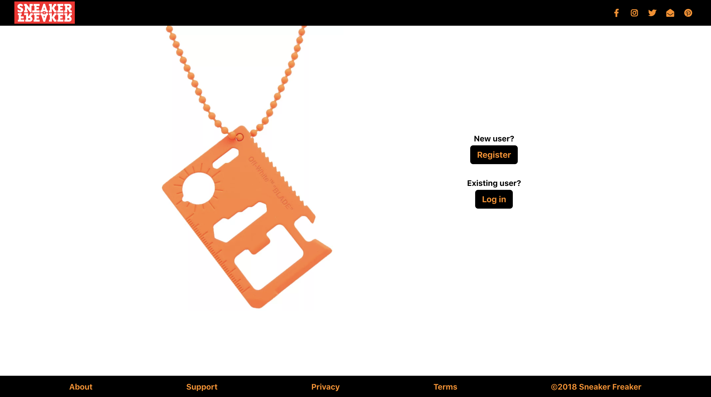
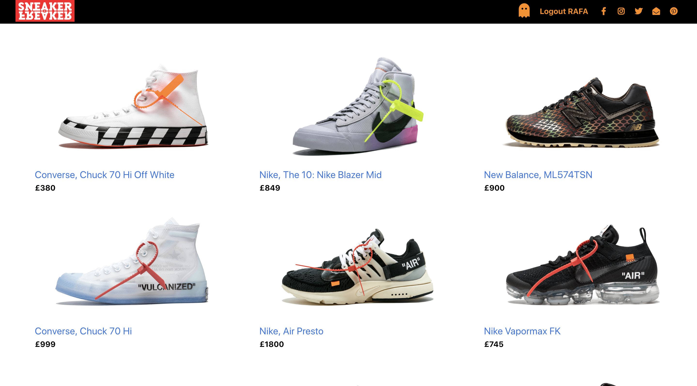
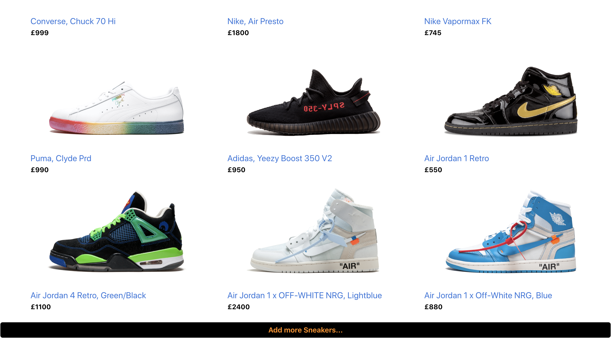
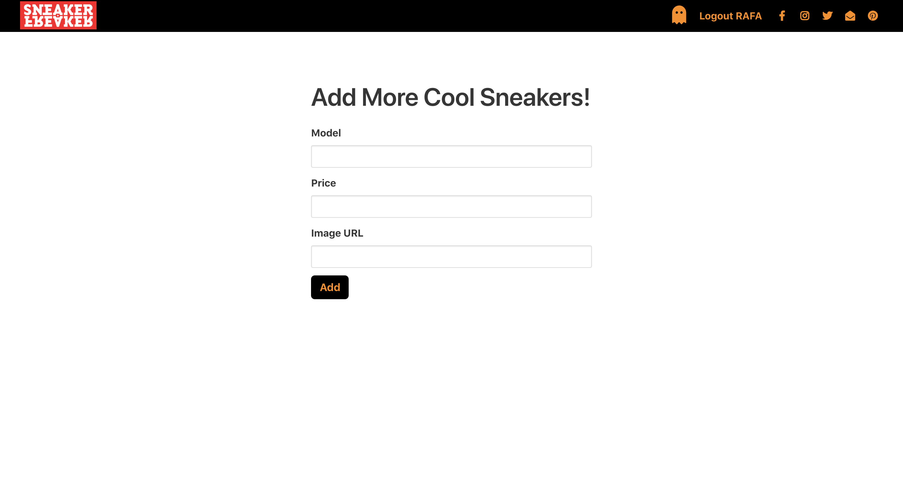
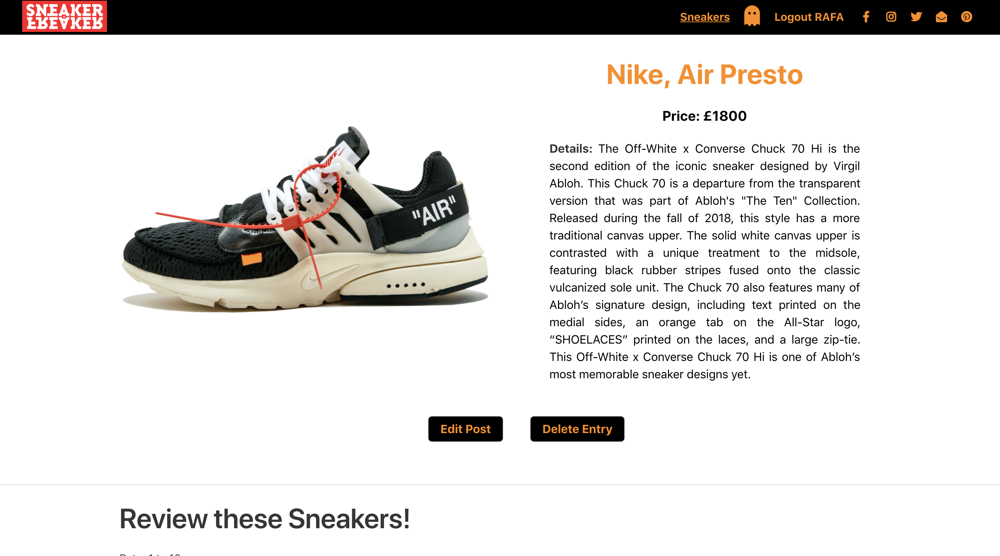
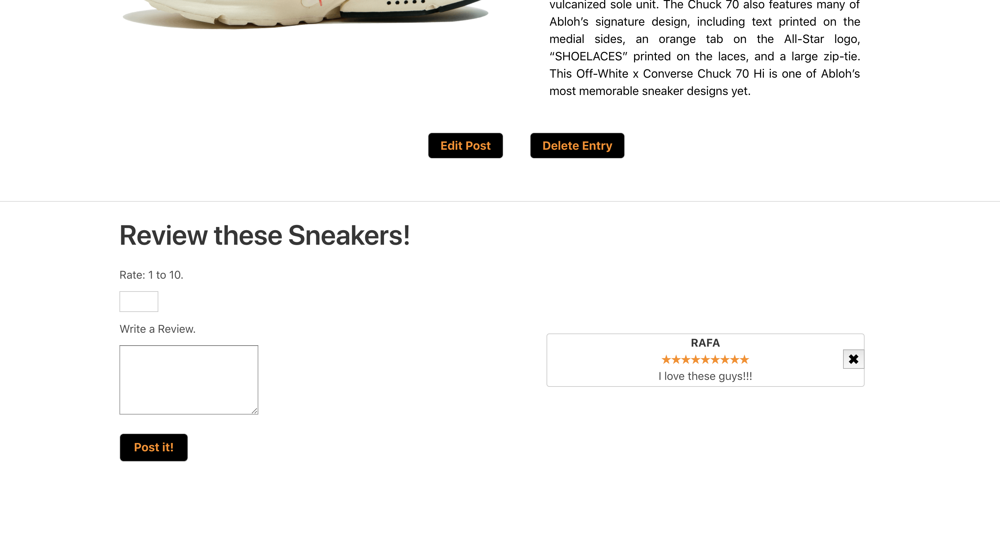

# WDI Project 2 - Sneaker Freaker

# Overview

Sneaker Freaker is a blog site for cool and trendy sneakers where users can upload their sneakers and post reviews about them.

it is mandatory to register and login to access to the blog content.

This is my second project from General Assembly's Web development course and was done in a week. It was my first project which involved using both front-end and back-end as well as fully RESTful routes. It was an individual project and made me understand the concept of incorporating data into web apps.

Go to [Website](https://project2-sneakerfreaker.herokuapp.com) and [GitHub](https://github.com/Rafcoding/wdi-project-two).

## Timeframe

1 week (November 2018)

# Brief

Create a web app that meets the following technical requirements:

* Have at least 2 models – one representing a user and one that represents the main resource of your app.
* Include relationships - embedded or referenced.
* The app should include authentication.
* Have complete RESTful routes for at least one of your resources with all CRUD actions.
* Be deployed online and accessible to the public.

# Technologies Used

* EJS
* CSS3
* CSS
* JavaScript(ES6)
* Git
* GitHub
* Heroku
* MongoDB
* Express
* Node.js

# Aim of the Blog

The aim of Sneaker Freaker is to create a community where Sneakers lovers can post their latest picks and review them.

# Styling and Idea

the idea of creating Sneaker Freaker comes from my passion for fashion and mainly for Sneakers.

For the Styling, I picked orange and black as a main colours for the blog site, I have used CSS3 and JavaScript for the display and functionality of the content.

# Screenshots

Intro

Index page, at then end of this page the user can upload new sneakers.

Create page, just as simple as adding model, price and image to create a new product.

Show page, from where it is possible to Edit or Delete posts as well as creating reviews for the products.

All the info about the product is show here.

Reviews can be added and delete here.

# Wins and Blockers

When I first started this project I didn't spend enough timing planning and ultimately had to take a step back and rethink my approach. After taking some time to properly map out what I needed to produce it was easy to brake the project into small manageable jobs. I tried to make sure that after each stage the code I had written was working correctly before moving on.

Adding the ability to show all of the reviews made by a user and the delete function to these comments was a major success for me. I'm really happy with the overall look of the site and pleased that it's also mobile responsive.

# Future Content

* More products.
* Shopping section (2nd hand, Brand new, etc).
* Average rating.
